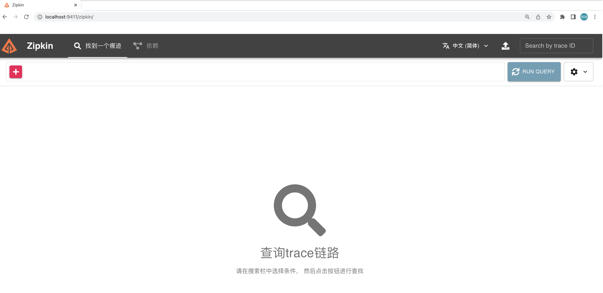
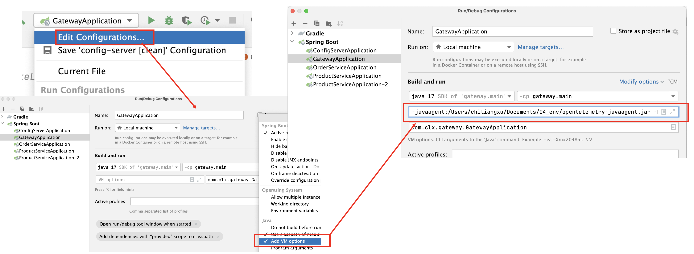

# 搭建Zipkin

这里直接用docker启动，启动之后直接访问

```
docker run -d -p 9411:9411 openzipkin/zipkin
```




# OpenTelemetry的使用

OpenTelemetry主要用于日志的收集，它是通过Java Agent的方式进行启动的，对代码没有侵入性，所以无需修改代码。下面演示在Idea中，如何通过Java Agent的方式启动工程。

1、下载OpenTelemetry（本质上就是个jar包），下载如下

```
https://github.com/open-telemetry/opentelemetry-java-instrumentation/releases/latest/download/opentelemetry-javaagent.jar
```


2、在Idea中，启动OpenTelemetry，添加如下图代码

```
-javaagent:/Users/chiliangxu/Documents/04_env/opentelemetry-javaagent.jar -Dotel.resource.attributes=service.name=gateway -Dotel.metrics.exporter=none -Dotel.traces.exporter=zipkin
```

这里注意两个地方

-  jar包的路径修改为本地对应的路径。

-  service.name 需要设置成对应模块的名字（当然名字也可以随便起），比如这里设置的是gateway，下面演示的也是给网关模块添加opentelemetry。


具体在Idea中添加方法如下：




我们用同样的方法，将order和product服务也添加进去。添加的代码如下：

```
-javaagent:/Users/chiliangxu/Documents/04_env/opentelemetry-javaagent.jar -Dotel.resource.attributes=service.name=order -Dotel.metrics.exporter=none -Dotel.traces.exporter=zipkin
```


```
-javaagent:/Users/chiliangxu/Documents/04_env/opentelemetry-javaagent.jar -Dotel.resource.attributes=service.name=product -Dotel.metrics.exporter=none -Dotel.traces.exporter=zipkin
```


3、启动工程，会发现启动log时，包含opentelemetry信息。


4、测试访问，比如从网关开始，调用获取订单商品的接口。然后查看zipkin，可以发现对应的调用链。


通过上面，可以看到整个服务的调用链和每个请求花费的时间。


